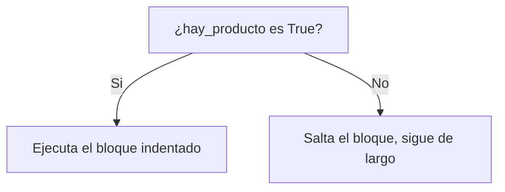
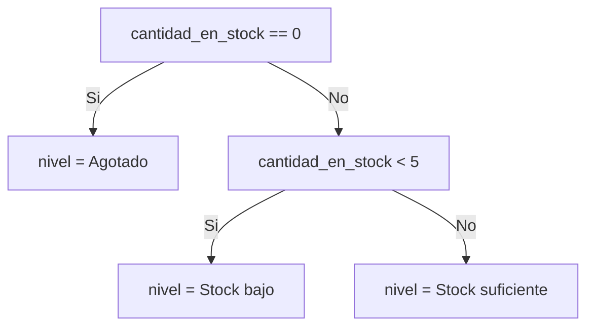
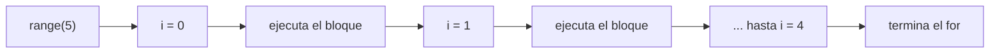
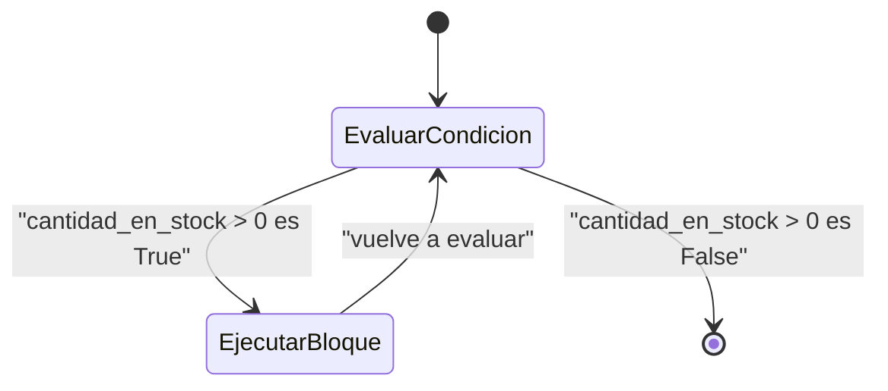
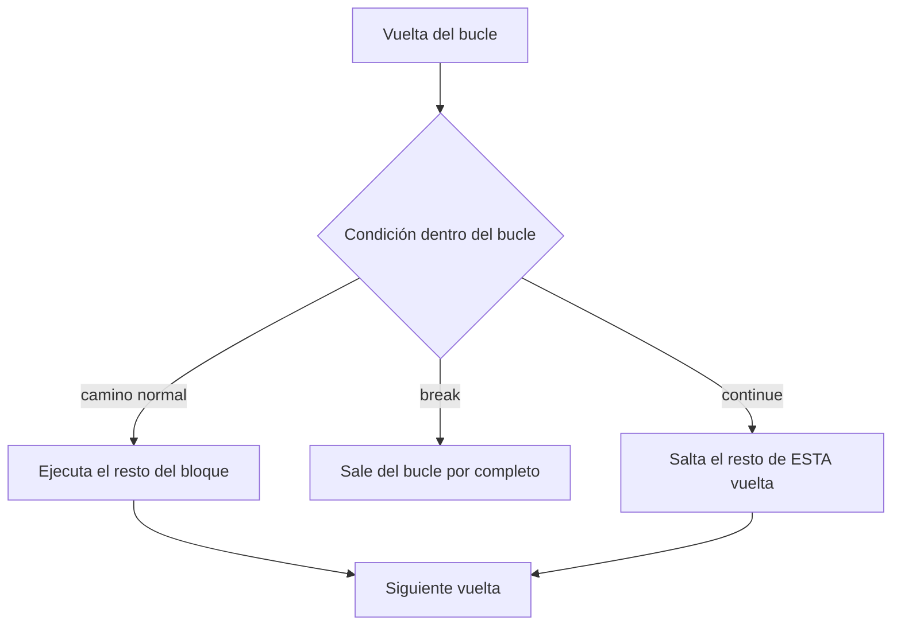

## El problema: sabes la respuesta, pero el programa no hace nada con ella

En la lección anterior llegaste hasta aquí:

```python
precio = 15990.0
disponible = True
precio_razonable = precio < 20000

hay_producto = disponible and precio_razonable
print(hay_producto)
```

```text
True
```

Ya tienes la respuesta: `True`. Pero un `print` no es una decisión — solo te muestra el valor en pantalla. Si `hay_producto` fuera `False`, el programa igual seguiría ejecutando exactamente las mismas líneas, sin cambiar nada. ¿Cómo le dices a Python "si esto es `True`, haz A; si es `False`, haz B"? Y una vez que sepas decidir para un producto, ¿cómo repites esa misma decisión para los doscientos productos de la tienda sin copiar y pegar el código doscientas veces?

Esas dos preguntas —decidir y repetir— son el control de flujo, y son el tema de esta lección.

## La solución: decidir con `if`

**En la práctica**, el bloque `if` ejecuta código solo cuando la condición que le sigue es `True`:

```python
precio = 15990.0
disponible = True
precio_razonable = precio < 20000
hay_producto = disponible and precio_razonable

if hay_producto:
    print("El producto está listo para la venta")
```

```text
El producto está listo para la venta
```

Si `hay_producto` fuera `False`, la línea del `print` simplemente no se ejecuta — Python la salta por completo. Nota los **dos puntos** al final de la línea del `if` y la **indentación** (sangría) de la línea siguiente: en Python esa sangría no es estética, es la forma en que el lenguaje sabe qué código pertenece al bloque condicional.



> **Condicional (`if`):** estructura que ejecuta un bloque de código únicamente cuando la condición evaluada es `True`. Toda línea que empiece con más sangría que el `if` pertenece a ese bloque.

Esto es lo que le faltaba al `True`/`False` de la lección anterior: convertir una pregunta respondida en una acción distinta según la respuesta.

## Dos caminos: `if` / `else`

**Situación:** decidir qué hacer cuando la condición es `True` ya lo resolviste. Pero también quieres que pase algo específico cuando sea `False` — no solo "no hacer nada".

```python
cantidad_en_stock = 0

if cantidad_en_stock > 0:
    print("Hay unidades disponibles")
else:
    print("Producto agotado")
```

```text
Producto agotado
```

`else` cubre exactamente el caso contrario del `if` — no lleva condición propia porque significa "en cualquier otro caso". Los dos bloques son mutuamente excluyentes: se ejecuta uno o el otro, nunca ambos.

> **`if` / `else`:** dos caminos posibles y complementarios. `if` corre cuando la condición es `True`; `else` corre en cualquier otro caso, sin evaluar nada por sí mismo.

## Más de dos caminos: `elif`

**Situación:** con solo `if`/`else` puedes distinguir dos casos, pero la tienda necesita clasificar el stock en **tres** niveles: agotado, bajo o suficiente. Encadenar `if` sueltos, uno detrás de otro, obliga a Python a evaluar los tres aunque el primero ya haya sido cierto — y peor, nada impide que dos de esos `if` sean verdaderos a la vez y ejecuten código contradictorio.

`elif` (abreviatura de "else if") resuelve esto: encadena condiciones donde solo se ejecuta la **primera** que resulte `True`, y ninguna de las siguientes se evalúa siquiera:

```python
cantidad_en_stock = 3

if cantidad_en_stock == 0:
    nivel = "Agotado"
elif cantidad_en_stock < 5:
    nivel = "Stock bajo"
else:
    nivel = "Stock suficiente"

print(nivel)
```

```text
Stock bajo
```

El orden importa: Python evalúa de arriba hacia abajo y se detiene en la primera condición verdadera. Si hubieras escrito primero `elif cantidad_en_stock < 5` y después `if cantidad_en_stock == 0`, el caso `0` también cumpliría `0 < 5` y nunca llegarías a distinguirlo como "Agotado".



> **`elif`:** condición adicional evaluada solo si todas las anteriores en la cadena fueron `False`. Una cadena `if`/`elif`/…/`else` ejecuta como máximo un bloque, nunca más de uno.

Puedes encadenar tantos `elif` como necesites; `else` al final es opcional, pero conviene mantenerlo para cubrir el caso que no anticipaste.

## El problema de repetir: producto por producto

Ya sabes clasificar el stock de **un** producto. Pero la tienda no tiene un producto, tiene un inventario completo. Copiar y pegar el mismo bloque `if`/`elif`/`else` una vez por cada producto no escala: si la tienda tiene 5 productos hoy, escribes el bloque 5 veces; si mañana tiene 200, necesitas escribirlo 200 veces, y si cambias la lógica de clasificación tienes que actualizar las 200 copias sin equivocarte en ninguna.

Lo que necesitas es decirle a Python "ejecuta este mismo bloque de código una vez por cada producto" — eso es un **bucle**.

## La solución: `for` y `range()`

**En la práctica**, `for` repite un bloque de código una vez por cada valor de una secuencia. La función `range()` genera una secuencia de números enteros, ideal cuando quieres repetir un número conocido de veces:

```python
cantidades_en_stock = [0, 3, 12, 0, 7]

for i in range(len(cantidades_en_stock)):
    cantidad = cantidades_en_stock[i]
    if cantidad == 0:
        print(f"Producto {i}: agotado")
    else:
        print(f"Producto {i}: {cantidad} unidades")
```

```text
Producto 0: agotado
Producto 1: 3 unidades
Producto 2: 12 unidades
Producto 3: agotado
Producto 4: 7 unidades
```

`range(len(cantidades_en_stock))` genera `0, 1, 2, 3, 4` — un índice por cada posición de la lista. En cada vuelta del bucle, `i` toma el siguiente valor de esa secuencia y el bloque indentado se ejecuta completo antes de pasar al siguiente. `range(5)` por sí solo también funciona si solo necesitas contar, sin acompañarlo de una lista.



> **Bucle `for`:** repite un bloque de código una vez por cada elemento de una secuencia. `range(n)` genera la secuencia `0, 1, …, n-1`, útil cuando necesitas repetir un número exacto de veces o recorrer por índice.

Esto es lo que resuelve el problema de entrada de esta sección: la misma lógica de clasificación, escrita una sola vez, se aplica a un inventario de cualquier tamaño.

## Repetir mientras algo sea cierto: `while`

**Situación:** `for` es perfecto cuando sabes de antemano cuántas veces vas a repetir — el tamaño de la lista, un `range()` fijo. Pero a veces no lo sabes: quieres seguir descontando unidades del stock **hasta que se agote**, y no tienes forma de calcular por adelantado en qué vuelta exacta eso va a pasar.

`while` repite un bloque **mientras** su condición siga siendo `True`, sin límite de vueltas fijado de antemano:

```python
cantidad_en_stock = 5
pedidos_atendidos = 0

while cantidad_en_stock > 0:
    cantidad_en_stock -= 1     # descuenta una unidad vendida
    pedidos_atendidos += 1

print(f"Pedidos atendidos: {pedidos_atendidos}")
print(f"Stock final: {cantidad_en_stock}")
```

```text
Pedidos atendidos: 5
Stock final: 0
```

Cada vuelta, Python primero evalúa `cantidad_en_stock > 0`; si es `True`, ejecuta el bloque y vuelve a evaluar la condición desde cero. En cuanto la condición da `False`, el bucle termina. Si olvidas actualizar la variable que aparece en la condición —aquí, `cantidad_en_stock`— el bucle nunca termina: se llama **bucle infinito** y es el error más común al usar `while`.



> **Bucle `while`:** repite un bloque mientras su condición siga siendo `True`. A diferencia de `for`, el número de vueltas no se conoce de antemano — depende de cuándo la condición deje de cumplirse.

## Interrumpir el flujo: `break` y `continue`

**Situación:** a veces necesitas salirte de un bucle antes de que termine naturalmente, o saltarte una vuelta puntual sin abandonar el resto. `break` y `continue` te dan ese control fino dentro de un `for` o un `while`.

`break` corta el bucle por completo, sin importar cuántas vueltas quedaran:

```python
precios = [15990.0, 22000.0, 8990.0, 31000.0]

for precio in precios:
    if precio > 20000:
        print(f"Encontré el primer producto caro: {precio}")
        break
    print(f"Revisando: {precio}")
```

```text
Revisando: 15990.0
Encontré el primer producto caro: 22000.0
```

`continue` salta el resto del bloque en **esa** vuelta y sigue con la siguiente, sin salir del bucle:

```python
cantidades = [0, 3, 0, 7, 12]
total_disponible = 0

for cantidad in cantidades:
    if cantidad == 0:
        continue          # nada que sumar, salta al siguiente producto
    total_disponible += cantidad

print(f"Unidades totales disponibles: {total_disponible}")
```

```text
Unidades totales disponibles: 22
```



> **`break` / `continue`:** `break` termina el bucle de inmediato, sin ejecutar las vueltas restantes. `continue` termina solo la vuelta actual y pasa a la siguiente, sin salir del bucle.

## Buenas prácticas: legibilidad e indentación

En Python, la indentación **es sintaxis**, no una convención de estilo que puedas ignorar. Dos líneas con distinta cantidad de espacios al inicio, dentro del mismo bloque, producen un `IndentationError` — el programa ni siquiera llega a ejecutarse. La convención estándar es **4 espacios** por nivel de sangría (Colab lo hace automático al presionar `Tab` después de los dos puntos).

Cuando anidas un `if` dentro de un `for`, o un `for` dentro de otro `for`, cada nivel suma su propia sangría:

```python
inventario = [0, 3, 12]

for cantidad in inventario:
    if cantidad == 0:
        print("Agotado")
    else:
        if cantidad < 5:
            print("Stock bajo")
        else:
            print("Stock suficiente")
```

Anidar más de dos o tres niveles suele ser señal de que conviene reordenar la lógica con `elif` en vez de `if`/`else` anidados — es más fácil de leer una cadena plana que un árbol de sangrías creciendo hacia la derecha.

> Si ya programaste en otro lenguaje (Java, C, JavaScript), la diferencia clave es esta: ahí las llaves `{ }` delimitan el bloque y la indentación es solo cosmética; en Python, la indentación **es** el delimitador. No hay llaves que salven una sangría inconsistente.

## Resumen operativo

| Elemento | Sintaxis mínima | Para qué sirve |
|---|---|---|
| Condicional simple | `if condicion:` | Ejecuta un bloque solo si la condición es `True` |
| Dos caminos | `if condicion:` / `else:` | Un camino si es `True`, el otro si es `False` |
| Más de dos caminos | `if:` / `elif condicion:` / `else:` | Ejecuta como máximo un bloque de la cadena |
| Repetir un número conocido de veces | `for i in range(n):` | Recorre `0, 1, …, n-1` |
| Repetir mientras algo sea cierto | `while condicion:` | Repite hasta que la condición sea `False` |
| Salir del bucle | `break` | Corta el bucle por completo, sin terminar las vueltas restantes |
| Saltar una vuelta | `continue` | Salta el resto de la vuelta actual, sigue con la siguiente |

## Practica tú mismo

Antes de seguir a la próxima lección, resuelve estos tres ejercicios en un notebook de Colab. Están ordenados de menor a mayor dificultad — si ya tienes experiencia previa, avanza directo al que te rete de verdad.

**1. Validar disponibilidad (básico).** Dada la variable `cantidad_en_stock = 4`, escribe un `if`/`else` que imprima `"Disponible"` si la cantidad es mayor que cero, o `"Agotado"` en caso contrario. Prueba tu código cambiando el valor de `cantidad_en_stock` a `0` y confirma que el mensaje cambia.

**2. Clasificar por rango de precio (intermedio).** Tienes `precio = 45000` y `disponible = True`. Clasifica el producto con `elif` anidado en cuatro categorías: si `disponible` es `False`, imprime `"No disponible"` sin evaluar nada más; si está disponible, clasifica el precio en `"Económico"` (menor a 20000), `"Medio"` (entre 20000 y 50000) o `"Premium"` (mayor a 50000). Prueba con al menos tres combinaciones distintas de `precio` y `disponible`.

**3. Contar productos agotados (con bucle).** Dada la lista `inventario = [5, 0, 3, 0, 0, 8, 2]`, usa un `for` para recorrerla y contar cuántas posiciones tienen `0` unidades, guardando el total en una variable `productos_agotados`. Luego, usando `continue`, calcula también la suma de las unidades de los productos que **sí** tienen stock, sin sumar los agotados. Imprime ambos resultados al final.

## Síntesis

- El problema de entrada —tener un `True`/`False` pero no poder actuar sobre él— se resuelve con `if`: ejecuta un bloque solo cuando la condición se cumple.
- `else` cubre el camino contrario; `elif` encadena más de dos caminos evaluando en orden, deteniéndose en el primero que sea `True`.
- Repetir la misma lógica para muchos elementos sin copiar y pegar código es el trabajo de los bucles: `for` cuando conoces el número de repeticiones (a menudo con `range()`), `while` cuando dependes de que una condición deje de cumplirse.
- `break` corta un bucle por completo; `continue` salta solo la vuelta actual.
- La indentación en Python no es estilo, es sintaxis: define qué código pertenece a cada bloque.
- Con `if`/`elif`/`else`, `for`, `while`, `range()`, `break` y `continue` ya tienes todo el control de flujo básico de Python — la misma base que necesitas para resolver, con confianza, cualquier ejercicio que combine variables, condicionales y bucles sobre un problema sencillo.
