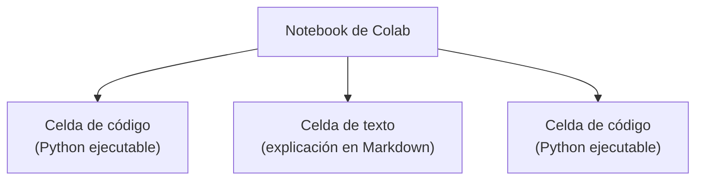
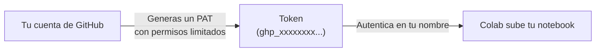
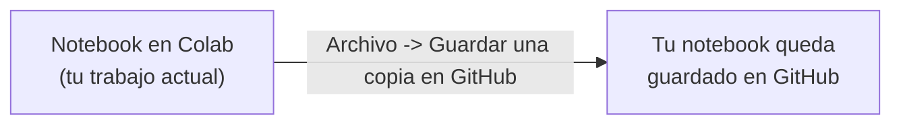
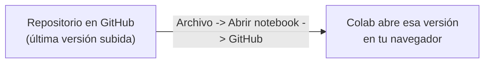

## Bienvenidos a Google Colab: tu cuaderno en la nube

Todo este curso se trabaja en **Google Colab**: no vas a instalar Python, ni Git, ni ninguna librería en tu computador. Solo necesitas un navegador y una cuenta de Google. Un **notebook** de Colab es un documento que mezcla dos tipos de bloques —de código y de texto— y vive guardado automáticamente en tu Google Drive, accesible desde cualquier equipo.



Un notebook típico alterna estos dos tipos de celda: código que resuelve el ejercicio y texto que explica qué hiciste y por qué.

## Celdas de código: escribir y ejecutar Python

**En la práctica**, en la barra superior de Colab hay un botón `+ Código` que agrega una celda nueva. Escribes Python adentro y la ejecutas con `Shift + Enter` — el resultado aparece justo debajo, sin salir del notebook.

```python
# Escribe esto en una celda de código y ejecútala con Shift + Enter
nombre = "Ana"
print(f"Hola, {nombre}. Bienvenida al curso.")
```

```text
Hola, Ana. Bienvenida al curso.
```

Puedes tener varias celdas de código en el mismo notebook y ejecutarlas en el orden que necesites — cada una guarda su resultado hasta que la vuelvas a correr.

## Celdas de texto: documentar con Markdown

**En la práctica**, el botón `+ Texto` agrega una celda donde escribes explicaciones en **Markdown**: `#` para títulos, `**negrita**` para resaltar, `-` para listas. Esa celda no ejecuta código, solo se muestra como texto formateado.

```text
## Ejercicio 1: suma de dos números
Este ejercicio calcula la suma de dos valores ingresados por el usuario
y explica por qué se valida que ambos sean numéricos antes de sumarlos.
```

Alternar código y texto no es decoración: documenta tu razonamiento, no solo el resultado. En los laboratorios de este curso vas a usar celdas de texto para explicar tus decisiones.

## Guardar tu trabajo en GitHub

**GitHub** es la plataforma en la nube donde vas a guardar cada notebook que produzcas en este curso, de forma que quede accesible desde cualquier computador y visible para tu docente. Cada vez que subes una versión, GitHub la conserva junto con las anteriores, así nunca pierdes tu trabajo.

## Crear el proyecto del curso en GitHub

**En la práctica**, hoy vas a crear en tu cuenta de GitHub el proyecto del curso —GitHub lo llama _repository_ (repositorio): es simplemente la carpeta en la nube donde va a vivir todo tu trabajo del semestre— con esta estructura inicial:

```text
curso-programacion-cientifica/
├── ejercicios/
│   └── README.md
└── README.md
```

Desde ese momento, cada notebook que subas queda guardado con fecha y autor. Puedes ver esa lista completa en la pestaña de tu proyecto en GitHub, aunque hoy no necesitas usarla todavía.

## Conectar Colab con GitHub: el Personal Access Token

**Situación:** para que Colab pueda subir tu notebook a GitHub en tu nombre, necesita autenticarse — probar que eres tú. GitHub dejó de aceptar usuario y contraseña para esto por razones de seguridad: una contraseña filtrada da acceso a toda tu cuenta.

**En la práctica**, GitHub usa en su lugar un **Personal Access Token (PAT)**: una clave larga y aleatoria que generas desde tu cuenta, con permisos específicos y una fecha de vencimiento.



> **Personal Access Token (PAT):** clave de acceso que reemplaza a la contraseña para autenticar herramientas externas —como Colab— contra tu cuenta de GitHub. Se puede revocar en cualquier momento sin cambiar tu contraseña.

## Guardar el token sin exponerlo: Colab Secrets

**Situación:** si pegas tu PAT directamente en una celda del notebook, cualquiera que vea ese notebook —incluido el repositorio público donde lo subes— puede copiarlo y usarlo como si fuera tu cuenta.

**En la práctica**, Colab tiene un panel de _Secrets_ (el ícono de llave en la barra lateral) donde guardas el token una sola vez, bajo un nombre:

```text
Nombre del secret: GITHUB_TOKEN
Valor: ghp_xxxxxxxxxxxxxxxxxxxx
```

Desde ese momento, cualquier notebook tuyo puede referenciar `GITHUB_TOKEN` sin que el valor real quede escrito en ninguna celda ni se suba nunca al repositorio.

> **Colab Secret:** valor sensible (como un token) guardado de forma privada en tu cuenta de Colab, disponible para tus notebooks sin quedar expuesto en el código.
> ⚠️ Nunca pegues el PAT directamente en una celda de código, ni siquiera "para probar rápido" — subirlo por accidente obliga a revocarlo de inmediato.

## Subir tu notebook a GitHub sin escribir un comando

**En la práctica**, Colab tiene un botón que sube tu notebook completo a GitHub:

```text
Archivo → Guardar una copia en GitHub
```

Al hacer clic ahí, Colab te deja elegir el repositorio, la carpeta (`ejercicios/`) y escribir un mensaje describiendo qué cambió — y sube el notebook con una sola acción.



Este mecanismo se llama en el curso **Flujo A**, y es el que vas a usar cada semana durante los ejercicios guiados: un notebook por sesión, una subida por notebook.

## Traer los cambios más recientes a Colab

**Situación:** tu compañero de equipo subió una versión más reciente del notebook a GitHub. ¿Cómo la traes a tu Colab?

**En la práctica**, no hay que descargar nada a mano: abres el notebook directamente desde GitHub.

```text
Archivo → Abrir notebook → pestaña GitHub → busca el repositorio → selecciona el notebook
```



Cada vez que abres el notebook así, Colab te muestra la última versión guardada en GitHub, no una copia vieja que tenías por ahí.

## Práctica de la sesión

Con esto ya puedes ejecutar el flujo completo de hoy: crear el proyecto del curso en GitHub, generar tu PAT y guardarlo como Colab Secret con el nombre `GITHUB_TOKEN`, crear la carpeta `ejercicios/` con un `README.md` inicial, y escribir un notebook corto con al menos una celda de código y una de texto. Súbelo a GitHub con el botón de Colab, y luego vuelve a abrirlo desde GitHub para confirmar que ves la versión que acabas de subir. Ese primer notebook subido, junto con el resultado del diagnóstico, es la evidencia de seguimiento de esta sesión.

## Síntesis

- El diagnóstico de hoy (cuestionario + reto de lógica) no tiene nota; ubica tu punto de partida para el resto del curso.
- Un notebook de Colab combina **celdas de código** (Python ejecutable, `Shift + Enter`) y **celdas de texto** (Markdown, para explicar tu razonamiento).
- Guardar solo en Colab no basta: necesitas un lugar compartido que conserve versiones anteriores de tu trabajo — eso es GitHub.
- GitHub autentica con un **Personal Access Token (PAT)**, no con contraseña, y ese token se guarda como **Colab Secret** para que nunca quede expuesto en un notebook.
- Subes tu trabajo con `Archivo → Guardar una copia en GitHub` (**Flujo A**) y lo traes actualizado con `Archivo → Abrir notebook → GitHub` — ambos sin escribir un solo comando.
