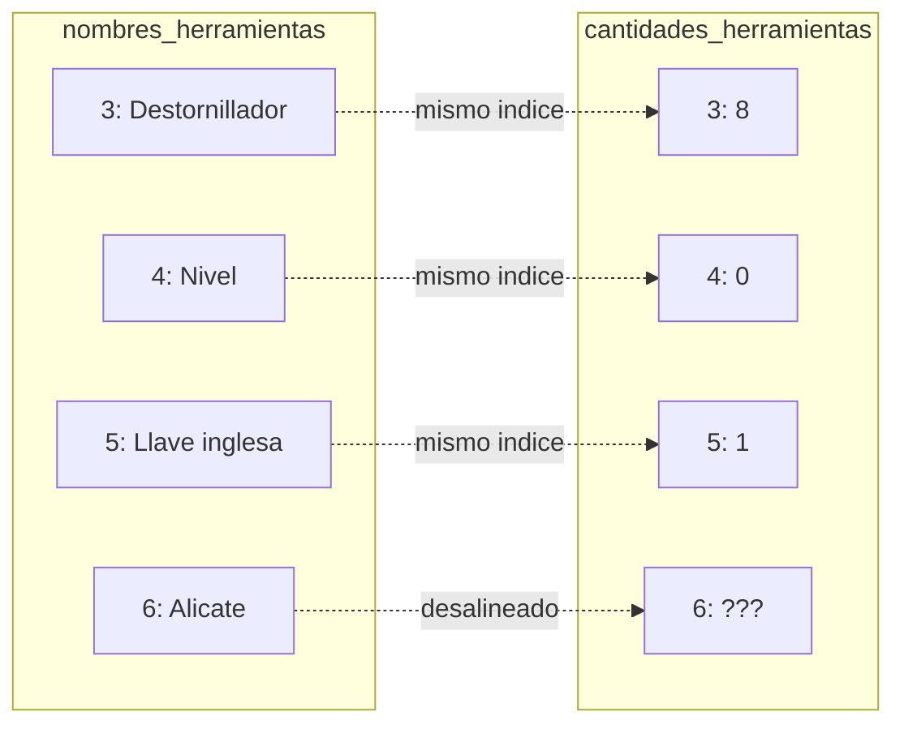
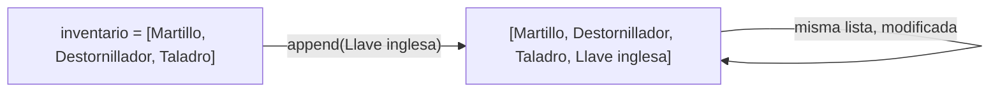
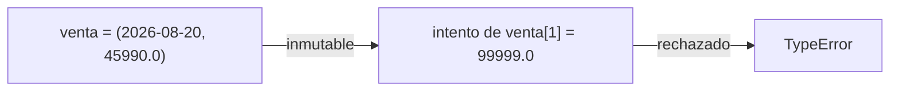
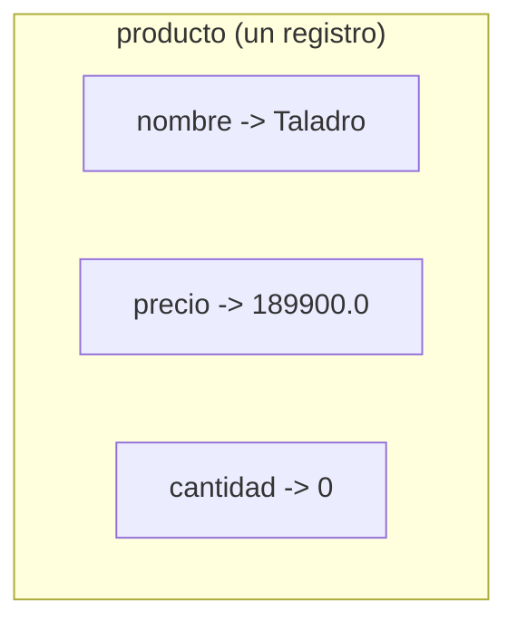
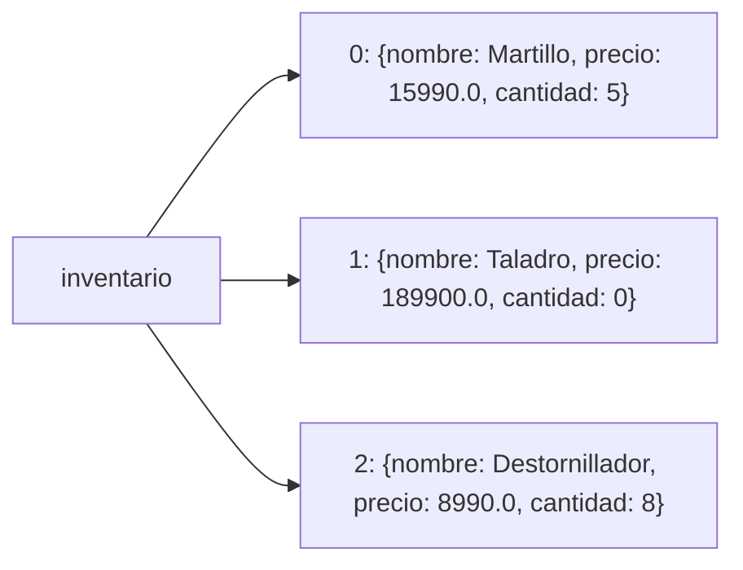
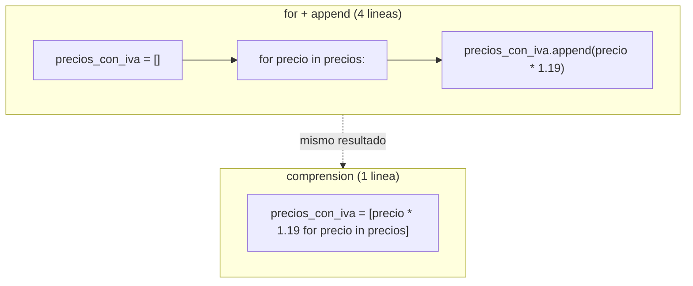

## El problema: datos que deberían viajar juntos, pero viven en listas separadas

En el taller de la semana pasada, el inventario de la ferretería quedó representado con dos listas paralelas:

```python
nombres_herramientas = ["Martillo", "Taladro", "Sierra", "Destornillador", "Nivel", "Llave inglesa"]
cantidades_herramientas = [5, 0, 2, 8, 0, 1]
```

Para saber cuántas unidades hay de `"Destornillador"`, buscas su posición en la primera lista (índice `3`) y usas ese mismo índice en la segunda. Funciona, hasta que llega una herramienta nueva:

```python
nombres_herramientas.append("Alicate")
# se te olvidó esta línea:
# cantidades_herramientas.append(15)
```

Ahora `nombres_herramientas` tiene 7 elementos y `cantidades_herramientas` sigue con 6. El índice `6` de nombres apunta a `"Alicate"`, pero ese mismo índice ya no existe en cantidades — y si existiera, apuntaría a un número que no le corresponde. Nada en Python te avisa de este error: el programa sigue corriendo con datos desalineados.



El problema de fondo no es el `append` olvidado: es que el nombre y la cantidad de una misma herramienta viven en dos contenedores distintos, unidos solo por una coincidencia de posición que tú tienes que mantener a mano. Lo que necesitas es una forma de agrupar nombre, precio y cantidad de **un mismo producto** en una sola unidad — y, por separado, una forma de garantizar que una lista de clientes no repita a nadie. Python resuelve ambos problemas con cuatro estructuras nativas: lista, tupla, diccionario y conjunto.

## La lista: la estructura que ya conoces, ahora a fondo

Ya usaste listas para guardar `cantidades_herramientas` o `precios` en talleres anteriores: se crean con corchetes y se indexan desde `0`.

```python
precios = [15990.0, 22000.0, 8990.0]
print(precios[0])
print(precios[-1])   # el ultimo elemento, sin calcular la posicion
```

```text
15990.0
8990.0
```

Lo que no habías visto son sus métodos y el slicing. Una lista es **mutable**: puedes cambiarla después de creada, sin construir una nueva.

```python
inventario = ["Martillo", "Destornillador", "Taladro"]

inventario.append("Llave inglesa")     # agrega al final
inventario.insert(1, "Serrucho")       # inserta en la posicion 1
inventario.remove("Destornillador")    # elimina por valor
ultimo = inventario.pop()              # elimina y devuelve el ultimo
inventario.sort()                      # ordena in-place, alfabeticamente

print(inventario)
print(f"Se retiro: {ultimo}")
print(inventario[0:2])   # slicing: los dos primeros elementos
```

```text
['Martillo', 'Serrucho', 'Taladro']
Se retiro: Llave inglesa
['Martillo', 'Serrucho']
```



`sort()`, `append()` e `insert()` no devuelven una lista nueva: modifican la lista original **in-place**. Por eso `ultimo = inventario.pop()` guarda el elemento retirado, no la lista completa.

> **Lista (`list`):** colección ordenada y mutable de elementos, accesibles por posición (índice). Permite duplicados. Se crea con `[]`.

Esto es lo que ya tenías: orden fijo por posición y capacidad de cambiar el contenido después de creado. Pero seguía sin resolver el problema de agrupar datos distintos de un mismo producto — para eso necesitas otras dos estructuras.

## Cuando el orden no debería cambiar nunca: la tupla

**Situación:** registraste una venta que ya se cerró — fecha y monto no deberían poder alterarse después. Si guardas esos datos en una lista, cualquier línea del programa podría hacer `venta[1] = 99999.0` por accidente y nadie lo notaría hasta revisar la contabilidad.

**En la práctica**, una tupla se crea con paréntesis y, una vez creada, no admite `append`, `remove` ni asignación por índice:

```python
venta = ("2026-08-20", 45990.0)

fecha, monto = venta   # desempaquetado: dos variables en una linea
print(f"Venta del {fecha} por ${monto}")

venta[1] = 99999.0   # esto lanza un error
```

```text
Venta del 2026-08-20 por $45990.0
TypeError: 'tuple' object does not support item assignment
```

El **desempaquetado** (`fecha, monto = venta`) es una de las razones por las que las tuplas son cómodas: en una sola línea extraes cada valor a su propia variable, en el orden en que fueron empaquetados.



> **Tupla (`tuple`):** colección ordenada e **inmutable** de elementos. Se crea con `()`. Se usa para datos que forman un registro fijo — coordenadas, una fecha con un monto — donde la protección contra cambios accidentales importa más que la flexibilidad de una lista.

La tupla resuelve la mitad del problema de entrada: agrupa varios valores en una unidad. Pero el acceso sigue siendo por posición (`venta[0]`, `venta[1]`) — para un producto con nombre, precio y cantidad, recordar qué posición es cada cosa se vuelve tan frágil como las listas paralelas.

## Acceder por nombre, no por posición: el diccionario

**Situación:** volvamos al problema de entrada. Quieres agrupar nombre, precio y cantidad de **un mismo producto**, pero accediendo a cada dato por su nombre — `producto["precio"]` — en vez de memorizar que la posición `1` es el precio.

**En la práctica**, un diccionario asocia claves con valores:

```python
producto = {
    "nombre": "Taladro",
    "precio": 189900.0,
    "cantidad": 0,
}

print(producto["precio"])
print(producto.get("descuento", 0))   # clave inexistente: devuelve el default sin lanzar error

producto["cantidad"] = 3   # los diccionarios si son mutables
print(producto.keys())
print(producto.values())
print(producto.items())
```

```text
189900.0
0
dict_keys(['nombre', 'precio', 'cantidad'])
dict_values(['Taladro', 189900.0, 3])
dict_items([('nombre', 'Taladro'), ('precio', 189900.0), ('cantidad', 3)])
```

`producto["clave"]` lanza `KeyError` si la clave no existe; `.get("clave", default)` devuelve `default` en su lugar, útil cuando no estás seguro de que la clave esté presente. Un diccionario **sí es mutable**: puedes reasignar `producto["cantidad"]` sin recrear el diccionario completo.



Con un diccionario por producto, el inventario completo de la ferretería deja de ser dos listas paralelas y pasa a ser **una lista de diccionarios**: cada elemento agrupa todo lo que pertenece a un mismo producto, sin depender de que dos listas mantengan el mismo largo.



> **Diccionario (`dict`):** colección de pares clave-valor, mutable, accesible por clave en vez de por posición. Se crea con `{clave: valor, ...}`. Desde Python 3.7 conserva el orden de inserción, pero ese orden no es lo relevante — lo relevante es que accedes por nombre.

Esto es lo que faltaba: cada producto es un solo objeto con sus tres datos accesibles por nombre, y el inventario es simplemente una lista de esos objetos — recorrerla ya no arriesga desalinear nada, porque no hay una segunda lista con la que sincronizarse.

## Sin duplicados: el conjunto

**Situación:** al final del día tienes una lista con el nombre de cada cliente que hizo una compra — algunos compraron más de una vez y aparecen repetidos. ¿Cuántos clientes **distintos** pasaron por la tienda hoy?

**En la práctica**, un conjunto elimina duplicados automáticamente:

```python
clientes_del_dia = ["Ana", "Luis", "Ana", "Marta", "Luis", "Ana"]

clientes_unicos = set(clientes_del_dia)
print(clientes_unicos)
print(f"Clientes distintos: {len(clientes_unicos)}")

clientes_unicos.add("Pedro")
print(clientes_unicos)
```

```text
{'Ana', 'Luis', 'Marta'}
Clientes distintos: 3
```
```text
{'Ana', 'Luis', 'Marta', 'Pedro'}
```

Un conjunto **no tiene orden** — no esperes que `set(clientes_del_dia)` conserve la secuencia original ni que sea indexable con `clientes_unicos[0]`. Dos conjuntos también se pueden combinar directamente:

```python
clientes_lunes = {"Ana", "Luis", "Marta"}
clientes_martes = {"Luis", "Pedro"}

print(clientes_lunes | clientes_martes)   # union: todos, sin repetir
print(clientes_lunes & clientes_martes)   # interseccion: en ambos dias
```

```text
{'Ana', 'Luis', 'Marta', 'Pedro'}
{'Luis'}
```

> **Conjunto (`set`):** colección **no ordenada** de elementos únicos — no admite duplicados. Se crea con `{}` (con elementos) o `set()` (vacío; `{}` vacío crea un diccionario, no un conjunto). Útil cuando lo que importa es pertenencia y unicidad, no orden ni posición.

Esto resuelve la segunda mitad del problema de entrada: contar clientes distintos, o comparar dos conjuntos de datos, sin escribir tú mismo la lógica de "¿ya está en la lista?".

## Comprensión de listas: construir una lista a partir de otra, en una línea

Ya viste `append` en la sección de la lista: agrega un elemento al final. Repitiendo esa misma operación dentro de un `for`, puedes construir una lista nueva a partir de otra que ya tienes:

```python
precios = [15990.0, 189900.0, 25000.0, 8990.0]

precios_con_iva = []
for precio in precios:
    precios_con_iva.append(precio * 1.19)

print(precios_con_iva)
```

```text
[19028.1, 225981.0, 29750.0, 10698.1]
```

Cuatro líneas para una operación conceptualmente simple: "cada precio, multiplicado por 1.19". La **comprensión de listas** expresa exactamente esa idea en una sola línea:

```python
precios_con_iva = [precio * 1.19 for precio in precios]
print(precios_con_iva)

# con condicion: solo los productos por encima de $20.000
caros = [precio for precio in precios if precio > 20000]
print(caros)
```

```text
[19028.1, 225981.0, 29750.0, 10698.1]
[189900.0, 25000.0]
```



La forma general es `[expresión for elemento in iterable if condición]`: la `condición` es opcional y filtra qué elementos entran a la lista nueva antes de aplicarles la expresión.

> **Comprensión de listas (list comprehension):** sintaxis compacta para construir una lista nueva a partir de otro iterable, combinando en una línea lo que un `for` con `append` expresaría en varias. No introduce ninguna capacidad nueva — es una forma más corta de escribir el mismo patrón.

No reemplaza al `for` explícito cuando la lógica dentro del bucle es larga o tiene varios pasos; ahí, forzar todo en una línea sacrifica legibilidad. Su lugar es la transformación o el filtro simple de una lista, en una sola expresión clara.

## Elegir la estructura correcta

| Estructura | Mutable | Ordenada | Permite duplicados | Sintaxis de creación | Cuándo usarla |
|---|---|---|---|---|---|
| Lista (`list`) | Sí | Sí | Sí | `[1, 2, 3]` | Una colección que va a crecer, encogerse o reordenarse — el inventario completo |
| Tupla (`tuple`) | No | Sí | Sí | `(1, 2, 3)` | Un registro fijo que no debe cambiar tras crearse — una venta ya cerrada |
| Diccionario (`dict`) | Sí | Sí (de inserción) | Claves no, valores sí | `{"a": 1}` | Datos con nombre — nombre, precio y cantidad de un mismo producto |
| Conjunto (`set`) | Sí | No | No | `{1, 2, 3}` o `set()` | Verificar pertenencia o eliminar duplicados — clientes distintos del día |

## Síntesis

- El problema de entrada — nombre y cantidad de una herramienta desalineados entre dos listas paralelas — nace de usar la estructura equivocada para agrupar datos relacionados.
- La lista sigue siendo la estructura por defecto para colecciones que cambian de tamaño u orden; ahora la manejas con sus métodos (`append`, `insert`, `remove`, `pop`, `sort`) y con slicing.
- La tupla protege un registro fijo contra cambios accidentales, y su desempaquetado (`fecha, monto = venta`) es una forma cómoda de extraer varios valores a la vez.
- El diccionario resuelve el problema de entrada de raíz: agrupa nombre, precio y cantidad de un producto bajo claves con nombre, accesibles sin memorizar posiciones.
- El conjunto elimina duplicados automáticamente y responde preguntas de pertenencia — cuántos clientes distintos, qué hay en común entre dos días.
- La comprensión de listas comprime el patrón `for` + `append` en una línea, cuando la transformación o el filtro es simple.
- El inventario de la ferretería deja de ser dos listas sincronizadas a mano y pasa a ser una sola lista de diccionarios: cada producto, con todos sus datos juntos, en un solo lugar.
