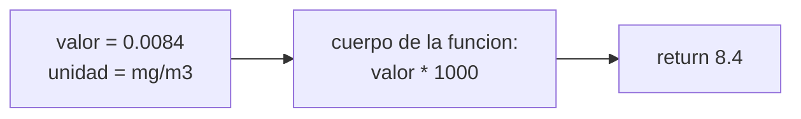
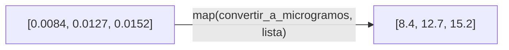
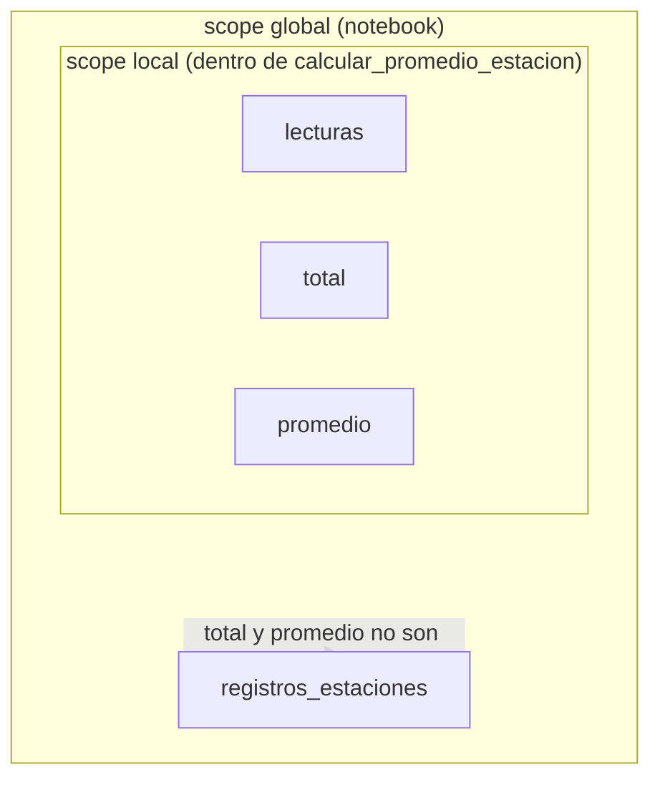

## El problema: tres celdas casi idénticas

En el taller evaluativo de la semana pasada guardaste los registros de la red de monitoreo de calidad del aire como una lista de diccionarios, uno por estación:

```python
registros_estaciones = [
    {"codigo": "EST-01", "sector": "Norte",  "coordenadas": (6.28, -75.57), "lecturas": [8.4, 12.7, 15.2]},
    {"codigo": "EST-02", "sector": "Centro", "coordenadas": (6.24, -75.58), "lecturas": [41.8, 58.3, 36.1]},
    {"codigo": "EST-03", "sector": "Sur",    "coordenadas": (6.19, -75.59), "lecturas": [9.6, 13.9, 7.5], "humedad_relativa": 68.0},
]
```

Un sensor nuevo, que todavía no se integró a `registros_estaciones`, reportó sus lecturas en mg/m³ y necesitas convertirlas a µg/m³ para compararlas con la escala oficial:

```python
lecturas_sensor_nuevo_mg = [0.0084, 0.0127, 0.0152]

lecturas_ug = []
for valor in lecturas_sensor_nuevo_mg:
    lecturas_ug.append(valor * 1000)

print(lecturas_ug)
```

```text
[8.4, 12.7, 15.2]
```

Dos celdas más abajo necesitas la misma conversión para otro sensor de campo que llegó tarde al notebook. Copias el bucle, cambias el nombre de la lista, ajustas el nombre de la variable. Y otra vez, para un tercero. Ahora tienes tres celdas casi idénticas: si mañana descubres que la constante de conversión estaba mal escrita, tienes que acordarte de corregirla en las tres.

```python
# celda 1: convierte las lecturas del sensor nuevo (mg/m3 -> ug/m3)
lecturas_ug_nuevo = []
for valor in lecturas_sensor_nuevo_mg:
    lecturas_ug_nuevo.append(valor * 1000)

# celda 2: convierte las lecturas de otro sensor de campo que llego despues (copiado y pegado)
lecturas_sensor_campo = [0.018, 0.022]
lecturas_ug_campo = []
for valor in lecturas_sensor_campo:
    lecturas_ug_campo.append(valor * 1000)
```

El código es correcto, pero está duplicado sin necesidad: la operación "convertir una lectura de mg/m³ a µg/m³" es la misma idea, escrita tres veces con nombres distintos. Lo que necesitas es **nombrar esa operación una sola vez** y reutilizarla en cada celda, sensor tras sensor. Eso es exactamente lo que resuelve `def`.

## Definiendo una función: parámetros, valores por defecto, retorno

Ya usaste funciones antes sin llamarlas así: `len(registros_estaciones)` cuenta cuántas estaciones hay, `sum(lecturas)` suma una lista de mediciones. `len` y `sum` son funciones que alguien más definió — reciben un dato, hacen algo con él y **devuelven** un resultado. `def` te deja escribir las tuyas.

```python
def convertir_a_microgramos(valor, unidad="mg/m3"):
    if unidad == "mg/m3":
        return valor * 1000
    return valor

directo = convertir_a_microgramos(15.2, unidad="ug/m3")
convertida = convertir_a_microgramos(0.0084)
print(directo, convertida)
```

```text
15.2 8.4
```

`valor` y `unidad` son los **parámetros**: los datos que la función necesita para trabajar. `unidad="mg/m3"` es un **valor por defecto** — si no lo indicas al llamar la función, asume que la lectura viene de un sensor de campo sin integrar todavía a la red (el caso que motivó la función) y la convierte. `return` entrega el resultado de vuelta a quien llamó la función, para que puedas guardarlo en una variable o usarlo en la siguiente línea.



Aquí está la confusión más frecuente al empezar: `print` y `return` no hacen lo mismo. `print` solo **muestra** algo en pantalla — no le sirve a otra parte del código. `return` **devuelve** un valor que sí puedes reutilizar.

```python
def convertir_mal(valor):
    print(valor * 1000)   # solo se ve en pantalla

def convertir_bien(valor):
    return valor * 1000   # se puede guardar y reutilizar

resultado = convertir_mal(0.0084)   # imprime 8.4, pero...
print(resultado)                     # ...resultado es None

resultado = convertir_bien(0.0084)
print(resultado / 2)   # si se puede seguir operando
```

```text
8.4
None
4.2
```

Si una función solo tiene `print` y ninguna otra parte del programa necesita su resultado, está bien — pero en cuanto quieras encadenar esa transformación con otra (filtrar, clasificar, promediar), necesitas `return`.

> **Función:** bloque de código con nombre que recibe parámetros, ejecuta un cuerpo, y opcionalmente devuelve un valor con `return`. Se define una vez con `def` y se reutiliza tantas veces como haga falta, con datos distintos cada vez.

Con `convertir_a_microgramos` definida una sola vez, las celdas del problema de entrada se reducen a una llamada por sensor: `convertir_a_microgramos(valor)`, sin repetir la constante de conversión.

## Aplicar la misma función a muchos datos: map y filter

`convertir_a_microgramos` funciona sobre **un** valor. Pero cada estación tiene varias lecturas. ¿Escribes un bucle cada vez que quieras aplicarla a todas?

```python
lecturas_ug = map(convertir_a_microgramos, lecturas_sensor_nuevo_mg)
print(list(lecturas_ug))
```

```text
[8.4, 12.7, 15.2]
```

`map(función, lista)` aplica `función` a **cada elemento** de `lista` y devuelve un objeto que puedes convertir a lista con `list(...)`. Es el mismo resultado que obtendrías con la comprensión de listas que ya conoces de la Semana 4 — `[convertir_a_microgramos(v) for v in lecturas_sensor_nuevo_mg]` — solo que `map` separa la función de dónde se aplica.



`filter` resuelve el problema complementario: quedarte solo con las lecturas que cumplen una condición. Junta las lecturas de las estaciones Norte y Centro y quédate solo con las que superan la categoría Moderada (más de 35.4 µg/m³):

```python
def supera_moderada(valor):
    return valor > 35.4

lecturas_norte_y_centro = registros_estaciones[0]["lecturas"] + registros_estaciones[1]["lecturas"]
lecturas_criticas = filter(supera_moderada, lecturas_norte_y_centro)
print(list(lecturas_criticas))
```

```text
[41.8, 58.3, 36.1]
```

De las seis lecturas originales (`[8.4, 12.7, 15.2, 41.8, 58.3, 36.1]`), `filter` descartó las tres primeras — son de la estación Norte, dentro de la categoría Moderada — y conservó solo las de Centro, que sí superan el umbral.

Cuando la condición cabe en una línea, no siempre vale la pena definirle un nombre con `def`. Python permite escribirla directamente dentro de `filter` con `lambda`:

```python
lecturas_criticas = filter(lambda valor: valor > 35.4, lecturas_norte_y_centro)
print(list(lecturas_criticas))
```

```text
[41.8, 58.3, 36.1]
```

`lambda valor: valor > 35.4` es exactamente `supera_moderada`, sin nombre propio — una función de una sola línea, hecha para usarse una vez y desecharse. No es un concepto nuevo: es una forma más corta de escribir `def` cuando el cuerpo de la función es una sola expresión.

> **`map` / `filter`:** funciones nativas que aplican otra función a cada elemento de un iterable — `map` transforma todos los elementos, `filter` conserva solo los que cumplen una condición (la función pasada debe devolver `True` o `False`).

Ya conocías la comprensión de listas para hacer esto mismo. La diferencia es de forma, no de resultado:

```python
# con map/filter
lecturas_ug = list(map(convertir_a_microgramos, lecturas_sensor_nuevo_mg))
criticas = list(filter(lambda v: v > 35.4, lecturas_norte_y_centro))

# equivalente con comprension de listas
lecturas_ug = [convertir_a_microgramos(v) for v in lecturas_sensor_nuevo_mg]
criticas = [v for v in lecturas_norte_y_centro if v > 35.4]
```

Ambas formas son válidas; en Python, la comprensión de listas suele preferirse por legibilidad, pero `map`/`filter` aparecen en mucho código existente y conviene reconocerlos.

> **Extensión opcional:** puedes encadenar `filter` y `map` en una sola expresión — por ejemplo, quedarte solo con las lecturas del sensor nuevo que superan 0.01 mg/m³ y convertirlas en un solo paso: `list(map(convertir_a_microgramos, filter(lambda v: v > 0.01, lecturas_sensor_nuevo_mg)))`. Compáralo con la comprensión equivalente: `[convertir_a_microgramos(v) for v in lecturas_sensor_nuevo_mg if v > 0.01]`.

## El alcance de las variables (scope)

Prueba esto en Colab:

```python
def calcular_promedio_estacion(lecturas):
    total = sum(lecturas)
    promedio = total / len(lecturas)
    return promedio

calcular_promedio_estacion(registros_estaciones[0]["lecturas"])
print(total)
```

```text
NameError: name 'total' is not defined
```

`total` existe dentro de `calcular_promedio_estacion` mientras la función se ejecuta, pero desaparece en cuanto la función termina. Fuera de la función, esa variable nunca existió — aunque la hayas visto asignarse una línea antes.



La regla práctica para este nivel: **una variable creada dentro de una función solo existe ahí adentro**, salvo que la devuelvas con `return`. Si necesitas usar `total` o `promedio` fuera de la función, tienes que devolverlos explícitamente:

```python
def calcular_promedio_estacion(lecturas):
    total = sum(lecturas)
    promedio = total / len(lecturas)
    return promedio   # solo esto sale de la funcion

promedio_norte = calcular_promedio_estacion(registros_estaciones[0]["lecturas"])
print(promedio_norte)   # esto si existe afuera
```

```text
12.1
```

> **Alcance (scope):** región del programa donde una variable existe y puede usarse. Una variable definida dentro de una función tiene alcance **local**: vive solo mientras la función se ejecuta y no es visible desde afuera, a menos que se devuelva con `return`.

Este es el motivo por el que `return` importa tanto: es la única puerta de salida de lo que se calculó adentro de una función hacia el resto del notebook.

## Buenas prácticas de modularización

No todo merece convertirse en función. La pregunta útil es: ¿vas a repetir esta operación con datos distintos más de una vez? Si sí, nómbrala. Si es un cálculo que ocurre una sola vez en todo el notebook, una función no aporta nada — solo indirección.

Criterios concretos para las funciones que escribas de aquí en adelante:

- **Una función, una transformación.** `convertir_a_microgramos` convierte; no debería además clasificar la lectura ni imprimir un reporte. Si notas que una función hace tres cosas, probablemente son tres funciones.
- **El nombre describe qué hace, con un verbo.** `convertir_a_microgramos`, `supera_moderada`, `calcular_promedio_estacion` — no `procesar` o `funcion1`, que no dicen nada sin leer el cuerpo.
- **Los parámetros son explícitos.** Una función que solo funciona porque adivina el nombre de una variable global (`registros_estaciones`) en vez de recibirla como parámetro es frágil: reutilízala con otra red de estaciones y falla en silencio o con un error confuso.
- **Prueba tu función con un caso simple antes de aplicarla a todo el dataset.** `convertir_a_microgramos(1.0)` debería dar `1000.0` — verificarlo con un valor conocido cuesta una línea y evita arrastrar un error a los cientos de lecturas de la red.

Una función que junta varios de estos criterios es la que clasifica una lectura según la escala oficial:

```python
def clasificar_calidad_aire(concentracion):
    if concentracion <= 12.0:
        return "Buena"
    if concentracion <= 35.4:
        return "Moderada"
    if concentracion <= 55.4:
        return "Dañina para grupos sensibles"
    return "Dañina para la salud"

categorias = list(map(clasificar_calidad_aire, registros_estaciones[1]["lecturas"]))
print(categorias)
```

```text
['Dañina para grupos sensibles', 'Dañina para la salud', 'Dañina para grupos sensibles']
```

Estas funciones —`convertir_a_microgramos`, `supera_moderada`, `calcular_promedio_estacion`, `clasificar_calidad_aire`— son las piezas que vas a seguir reutilizando conforme el curso avanza: en "Clases y objetos en Python" vas a ver cómo una función puede "vivir dentro" de un objeto, como uno de sus métodos, en vez de estar suelta en el notebook.

## Síntesis

- Copiar y pegar la misma transformación en varias celdas es una señal de que esa operación merece un nombre propio — eso es lo que `def` te permite hacer.
- `def nombre(parámetros): ... return valor` define una función; los valores por defecto (`unidad="mg/m3"`) cubren el caso más común sin obligarte a repetirlo en cada llamada.
- `print` muestra un valor en pantalla; `return` lo devuelve para que puedas seguir operando con él. Ya usabas funciones nativas como `len()` o `sum()` que hacen exactamente esto.
- `map` aplica una función a todos los elementos de una lista; `filter` conserva solo los que cumplen una condición. `lambda` es una forma corta de escribir una función de una línea, sin darle un nombre propio.
- Una variable definida dentro de una función solo existe ahí adentro, a menos que se devuelva con `return` — de ahí que el `return` sea la única salida de lo que se calculó dentro de una función.
- Una función por transformación, con un nombre que describe qué hace: ese criterio es el que vas a seguir aplicando en el resto del curso.
