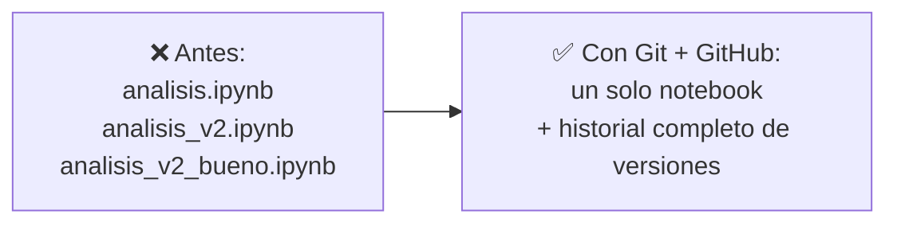
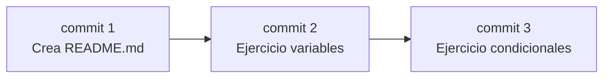
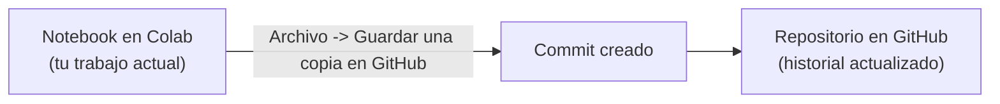
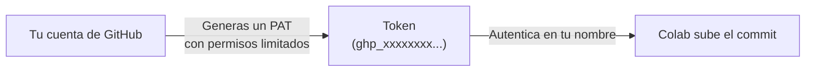

## Antes de empezar: un diagnóstico rápido

Hoy arrancamos con dos cosas cortas, antes de tocar Git: un cuestionario de autoevaluación sobre tu experiencia previa con programación y datos, y un reto breve de lógica —sin código— para ver cómo razonas un problema paso a paso. No es un examen ni suma nota. Es información para el docente: en este curso conviven estudiantes de primer semestre sin experiencia previa con estudiantes de semestres avanzados, y el diagnóstico ayuda a calibrar el ritmo y a decidir quién trabaja con quién. Resuelto eso, entramos al tema del día.

## El problema: perder el análisis que sí funcionaba

Imagina que llevas dos horas limpiando un dataset en un notebook de Colab: quitaste columnas, corregiste valores nulos, filtraste registros raros. Funciona. Cierras el navegador para almorzar y, al volver, decides "mejorar" un poco el filtro. Lo cambias, lo corres... y ahora los resultados no cuadran con los que le mostraste a tu compañero de equipo ayer.

- ¿Qué versión del filtro era la que sí funcionaba?
- ¿Puedes volver exactamente a como estaba el notebook antes de tu "mejora"?
- Si tu compañero abre el mismo notebook desde su cuenta, ¿está viendo la misma limpieza que tú, o una copia desactualizada?

Nada de esto es un problema de saber programar mejor. Es un problema de **no tener memoria** de cómo llegaste hasta donde estás — y es exactamente lo que resuelve el control de versiones.

## Más problemas que resuelve el control de versiones en análisis de datos

El ejemplo del notebook es solo uno de varios escenarios donde la falta de control de versiones se convierte en un dolor de cabeza en proyectos de datos:

**1. Un resultado que ya no puedes reproducir.** Generaste una gráfica para tu informe con una versión del análisis. Dos días después necesitas regenerarla, pero ya modificaste el notebook varias veces desde entonces — y no hay forma de volver al código exacto que produjo esa gráfica.

**2. Dos personas, un mismo dataset.** Tú y un compañero trabajan sobre el mismo proyecto. Cada uno limpia una parte distinta de los datos. Sin un lugar compartido con historial, terminan enviándose archivos por WhatsApp o por correo, y nunca queda claro cuál es la versión más reciente.

**3. Una limpieza que rompe algo que sí funcionaba.** Agregas un paso nuevo de transformación al dataset y, sin darte cuenta, dañas una columna que otra parte del análisis necesitaba intacta. Sin historial, no hay a dónde volver — toca reconstruir esa columna de memoria.

Los tres casos comparten lo mismo: necesitas poder **recuperar un estado anterior** de tu trabajo y **compartirlo** con alguien más, sin depender de copias sueltas ni de la memoria.

## La solución: un sistema que recuerda por ti

Un **sistema de control de versiones** guarda automáticamente cada cambio significativo de un proyecto —quién lo hizo, cuándo y por qué— sin que tengas que duplicar archivos a mano.



**Git** es el sistema de control de versiones más usado en la industria. **GitHub** es la plataforma en la nube donde guardas tu repositorio para poder acceder a él desde cualquier computador y compartirlo con otros. En este curso, Git corre por debajo de Colab: tú no escribes comandos en una terminal, pero es útil saber qué está pasando cuando haces clic en un botón.

> **Control de versiones:** la práctica de registrar los cambios realizados sobre uno o varios archivos a lo largo del tiempo, de modo que se pueda recuperar cualquier versión anterior cuando se necesite.

## Repositorio, commit e historial

**Situación:** para que Git pueda "recordar" tus cambios, primero necesita un lugar donde guardarlos, y una forma de marcar cada avance como un punto recuperable.

**En la práctica**, hoy vas a crear un repositorio en GitHub para el curso, con esta estructura inicial:

```text
curso-programacion-cientifica/
├── ejercicios/
│   └── README.md
└── README.md
```

Cada vez que subas un notebook terminado a ese repositorio, estás creando un **commit**: una fotografía de cómo estaba tu trabajo en ese momento exacto, con fecha, autor y un mensaje que describe qué cambió.



> **Repositorio:** carpeta en GitHub cuyo contenido está versionado. Guarda tu proyecto actual **y** todo su historial de cambios.
> **Commit:** una versión guardada y permanente de tu trabajo, con mensaje, autor y fecha, a la que siempre puedes volver.
> **Historial:** la secuencia completa y ordenada de commits de un repositorio — la memoria completa del proyecto.

## Un commit sin escribir un solo comando: Flujo A

**Situación:** en Estructuras de Datos, o en cualquier curso con terminal, un commit se hace con `git add` y `git commit`. Aquí no vas a abrir ninguna terminal — vas a trabajar completamente desde el navegador.

**En la práctica**, Colab tiene un botón que hace ese trabajo por ti:

```text
Archivo → Guardar una copia en GitHub
```

Al hacer clic ahí, Colab te deja elegir el repositorio, la carpeta (`ejercicios/`) y escribir un mensaje de commit — y sube el notebook completo con una sola acción.



Este mecanismo se llama en el curso **Flujo A**, y es el que vas a usar cada semana durante los ejercicios guiados: un notebook por sesión, un commit por notebook.

> **Flujo A:** subir un notebook completo a GitHub usando `Archivo → Guardar una copia en GitHub` desde Colab, sin comandos ni terminal.

## Por qué ya no basta con usuario y contraseña

**Situación:** para que Colab pueda subir tu notebook a GitHub en tu nombre, necesita autenticarse — probar que eres tú. GitHub dejó de aceptar usuario y contraseña para esto por razones de seguridad: una contraseña filtrada da acceso a toda tu cuenta.

**En la práctica**, GitHub usa en su lugar un **Personal Access Token (PAT)**: una clave larga y aleatoria que generas desde tu cuenta, con permisos específicos y una fecha de vencimiento.



> **Personal Access Token (PAT):** clave de acceso que reemplaza a la contraseña para autenticar herramientas externas —como Colab— contra tu cuenta de GitHub. Se puede revocar en cualquier momento sin cambiar tu contraseña.

## Guardar el PAT sin exponerlo: Colab Secrets

**Situación:** si pegas tu PAT directamente en una celda del notebook, cualquiera que vea ese notebook —incluido el repositorio público donde lo subes— puede copiarlo y usarlo como si fuera tu cuenta.

**En la práctica**, Colab tiene un panel de *Secrets* (el ícono de llave en la barra lateral) donde guardas el token una sola vez, bajo un nombre:

```text
Nombre del secret: GITHUB_TOKEN
Valor: ghp_xxxxxxxxxxxxxxxxxxxx
```

Desde ese momento, cualquier notebook tuyo puede referenciar `GITHUB_TOKEN` sin que el valor real quede escrito en ninguna celda ni se suba nunca al repositorio.

> **Colab Secret:** valor sensible (como un token) guardado de forma privada en tu cuenta de Colab, disponible para tus notebooks sin quedar expuesto en el código.
> ⚠️ Nunca pegues el PAT directamente en una celda de código, ni siquiera "para probar rápido" — un commit accidental con el token adentro obliga a revocarlo de inmediato.

## Lo que Git hace detrás del botón

Aunque hoy trabajas desde la interfaz de Colab, vale la pena saber qué comandos representan las acciones que estás ejecutando con clics. Los vas a encontrar mencionados durante el curso, y en el Flujo B más adelante sí los escribirás directamente.

| Comando | ¿Qué hace? | Equivalente en Colab hoy |
| --- | --- | --- |
| `git add` | Prepara los archivos modificados para el próximo commit | Implícito al elegir "Guardar una copia en GitHub" |
| `git commit` | Guarda los cambios preparados como un punto del historial | El mensaje que escribes en el diálogo de GitHub |
| `git status` | Muestra qué archivos cambiaron y cuáles están listos | Colab te lo muestra al detectar cambios en el notebook |
| `git log` | Lista el historial de commits | La pestaña de "Commits" de tu repositorio en GitHub |
| `git push` | Envía tus commits al repositorio remoto | Ocurre automáticamente al confirmar el diálogo |
| `git pull` | Trae al notebook los cambios que otros subieron | Abrir el notebook desde GitHub nuevamente |

## Práctica de la sesión

Con esto ya puedes ejecutar el flujo completo de hoy: crear el repositorio del curso en GitHub, generar tu PAT y guardarlo como Colab Secret con el nombre `GITHUB_TOKEN`, crear la carpeta `ejercicios/` con un `README.md` inicial, y practicar el Flujo A subiendo un ejercicio corto desde un notebook de Colab. Ese primer commit subido con Flujo A, junto con el resultado del diagnóstico, es la evidencia de seguimiento de esta sesión.

## Síntesis

- El diagnóstico de hoy (cuestionario + reto de lógica) no tiene nota; ubica tu punto de partida para el resto del curso.
- El control de versiones resuelve problemas reales de análisis de datos: perder un resultado que no puedes reproducir, no saber cuál es la versión más reciente de un dataset compartido, o no poder deshacer una limpieza que rompió algo que ya funcionaba.
- Un **repositorio** guarda tu proyecto y todo su historial; un **commit** es una versión guardada y recuperable de tu trabajo; el **historial** es la secuencia completa de esos commits.
- En este curso, los commits de las semanas 1 a 11 se hacen con **Flujo A**: `Archivo → Guardar una copia en GitHub` desde Colab, sin terminal.
- GitHub autentica con un **Personal Access Token (PAT)**, no con contraseña, y ese token se guarda como **Colab Secret** para que nunca quede expuesto en un notebook.
