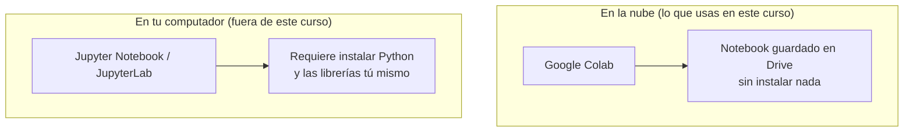
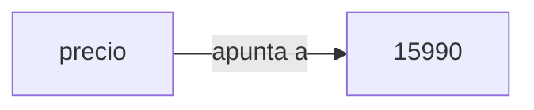
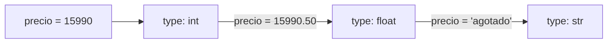
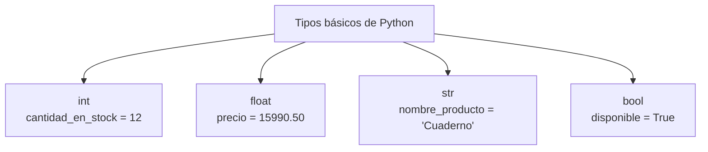
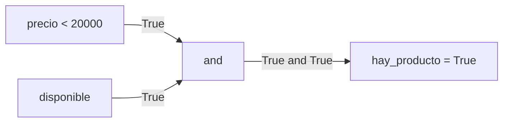

## El problema: la lista de precios que no puedes reutilizar

Imagina que estás ayudando a una tienda pequeña a organizar su inventario. Tienes un cuaderno con datos sueltos: el precio de un producto es `15990`, su nombre es `"Cuaderno cuadriculado"`, y todavía queda en bodega (`True`). Escribes esos tres valores en una celda de Colab, calculas el IVA a mano, anotas el resultado en papel... y para el siguiente producto, ¿vuelves a escribir todo desde cero?

Sin un lugar donde guardar esos valores con un nombre, cada cálculo empieza de la nada. No puedes decir "usa el precio de antes" ni "compara este precio con el anterior" — Python ya olvidó el `15990` en cuanto terminó de ejecutar esa línea. ¿Cómo le dices a Python "recuerda este valor, lo voy a necesitar más adelante"?

## Antes de seguir: dónde trabajas hoy

En la Semana 1 viste que un notebook de Colab combina celdas de código (Python ejecutable, `Shift + Enter`) y celdas de texto (Markdown, para explicar tu razonamiento). Hoy trabajas exactamente ahí: cada ejemplo de esta lección es código que puedes copiar en una celda y ejecutar de inmediato.

Fuera de este curso existe también **Jupyter**, la versión de notebooks que se instala en tu propio computador en vez de vivir en la nube de Google. La idea de celdas de código y de texto es la misma — Colab es, de hecho, Jupyter alojado por Google con acceso gratuito a computadores en la nube. No necesitas instalar nada de eso: te lo menciono solo para que reconozcas el nombre si lo ves en documentación o tutoriales.



## La solución: guardar cada valor en una variable

**En la práctica**, Python te deja poner un nombre a cualquier valor con el operador `=`. Ese nombre queda disponible en las celdas siguientes del notebook, sin necesidad de volver a escribir el valor:

```python
precio = 15990
nombre_producto = "Cuaderno cuadriculado"
disponible = True

print(precio)
```

```text
15990
```

`=` aquí no significa "es igual a" como en matemáticas — significa "asigna". A la izquierda va el nombre que eliges, a la derecha el valor que quieres recordar.



> **Variable:** nombre que apunta a un valor guardado en memoria. Asignar un valor a una variable no lo copia dentro del nombre — el nombre simplemente lo referencia, y puedes usarlo en cualquier celda posterior del mismo notebook.

Con esto ya resolviste el problema de entrada: `precio` sigue disponible línea tras línea, celda tras celda, hasta que reasignes la variable o reinicies el notebook.

## Tipado dinámico: Python decide el tipo por ti

**Situación:** ya guardaste `precio = 15990`. Más tarde, en otra celda, decides guardar ahí el precio con IVA incluido: `precio = "15990 con IVA"`. Python no se queja — simplemente ahora `precio` es otra cosa.

En muchos lenguajes tienes que declarar por adelantado qué tipo de dato va a vivir en cada variable, y esa decisión no puede cambiar después. Python no funciona así: **no declaras el tipo, Python lo infiere del valor que le asignas**, y ese tipo puede cambiar cada vez que reasignas la variable. Puedes comprobarlo con la función `type()`:

```python
precio = 15990
print(type(precio))       # el valor es un entero

precio = 15990.50
print(type(precio))       # ahora el mismo nombre apunta a un decimal

precio = "agotado"
print(type(precio))       # y ahora a texto
```

```text
<class 'int'>
<class 'float'>
<class 'str'>
```



> **Tipado dinámico:** el tipo de una variable se determina por el valor que contiene en cada momento, no por una declaración previa. Reasignar la variable con un valor de otro tipo es válido — el tipo simplemente cambia con ella.

Esto te da flexibilidad para escribir rápido, pero también significa que tú eres responsable de saber qué tipo tiene cada variable antes de operar con ella — sumar un número con un texto sin darte cuenta produce un error, como vas a ver en la siguiente sección.

## Los cuatro tipos básicos: int, float, str, bool

Con los datos de la tienda ya tienes ejemplo de los cuatro tipos que vas a usar constantemente en este curso:

| Tipo | Nombre | Ejemplo de la tienda | ¿Para qué sirve? |
|---|---|---|---|
| `int` | entero | `cantidad_en_stock = 12` | Contar unidades, cosas que no se dividen en fracciones |
| `float` | decimal (*floating point*) | `precio = 15990.50` | Precios, medidas, cualquier cantidad con decimales |
| `str` | cadena de texto (*string*) | `nombre_producto = "Cuaderno cuadriculado"` | Nombres, descripciones, cualquier texto |
| `bool` | booleano | `disponible = True` | Preguntas de sí/no: ¿hay stock?, ¿pasó la validación? |



Los valores de `bool` solo pueden ser `True` o `False`, **siempre con mayúscula inicial** — `true` a secas no existe en Python y produce un error. Un `str` va siempre entre comillas simples o dobles; sin comillas, Python interpreta el texto como el nombre de una variable.

## Operadores aritméticos: calcular con tus datos

**En la práctica**, con `int` y `float` puedes aplicar los operadores aritméticos de Python directamente sobre los precios de la tienda:

```python
precio = 15990.0
cantidad_en_stock = 12
porcentaje_iva = 0.19

iva = precio * porcentaje_iva          # multiplicación
precio_con_iva = precio + iva          # suma
valor_total_stock = precio * cantidad_en_stock   # multiplicación

descuento = precio * 0.10
precio_con_descuento = precio - descuento         # resta

unidades_por_caja = cantidad_en_stock // 5   # división entera: cuántas cajas completas de 5
sobrantes = cantidad_en_stock % 5            # módulo: cuántas unidades quedan sueltas
precio_al_cuadrado = precio ** 2             # potencia (poco útil aquí, pero existe)

print(precio_con_iva, unidades_por_caja, sobrantes)
```

```text
19028.1 2 2
```

`/` siempre da un `float`, aunque la división sea exacta (`10 / 2` da `5.0`, no `5`). `//` descarta la parte decimal del resultado y `%` te da el residuo de esa división — la pareja `//` y `%` es la que usas cuando necesitas repartir en grupos completos y saber qué sobra.

## Operadores de comparación y lógicos: preguntas que Python puede responder

**Situación:** quieres saber si un precio está por encima de cierto umbral, o si un producto está disponible y además tiene un precio razonable. Los operadores de comparación (`==`, `!=`, `>`, `<`, `>=`, `<=`) convierten esas preguntas en un valor `bool`:

```python
precio = 15990.0
disponible = True
temperatura = 18.5

print(precio > 20000)          # ¿el precio supera los 20000?
print(precio == 15990.0)       # ¿el precio es exactamente 15990.0?
print(temperatura != 20)       # ¿la temperatura es distinta de 20?
```

```text
False
True
True
```

Cuando la pregunta involucra más de una condición, combínalas con los operadores lógicos `and`, `or` y `not`:

```python
precio_razonable = precio < 20000
hay_producto = disponible and precio_razonable   # ¿disponible Y con precio razonable?
oferta_valida = precio < 10000 or disponible     # ¿precio muy bajo O disponible?

print(hay_producto)
print(not disponible)          # niega el valor: True se vuelve False
```

```text
True
False
```



Fíjate en algo importante: hasta aquí solo **evalúas** la pregunta y obtienes un `True` o `False` guardado en una variable. Python todavía no está *decidiendo* nada con esa respuesta — no está eligiendo ejecutar un bloque de código u otro según el resultado. Esa parte, tomar una decisión con el booleano que acabas de calcular, es lo que vas a aprender en la próxima lección.

## Resumen operativo

| Elemento | Sintaxis | Ejemplo | Resultado |
|---|---|---|---|
| Asignación | `nombre = valor` | `precio = 15990.0` | crea o reasigna la variable `precio` |
| Consultar el tipo | `type(nombre)` | `type(precio)` | `<class 'float'>` |
| Suma / resta | `+` / `-` | `precio - descuento` | `15990.0 - 1599.0` → `14391.0` |
| Multiplicación | `*` | `precio * cantidad` | `15990.0 * 12` → `191880.0` |
| División (siempre float) | `/` | `10 / 2` | `5.0` |
| División entera | `//` | `12 // 5` | `2` |
| Módulo (residuo) | `%` | `12 % 5` | `2` |
| Potencia | `**` | `2 ** 3` | `8` |
| Igualdad / desigualdad | `==` / `!=` | `precio == 15990.0` | `True` |
| Comparación | `>` `<` `>=` `<=` | `precio > 20000` | `False` |
| Y lógico | `and` | `disponible and precio_razonable` | `True` si ambas son `True` |
| O lógico | `or` | `precio < 10000 or disponible` | `True` si al menos una es `True` |
| Negación | `not` | `not disponible` | invierte el booleano |

## Síntesis

- El problema de partida —recalcular todo desde cero cada vez— se resuelve guardando cada valor con un nombre: una **variable**.
- Sigues trabajando en Colab, igual que en la Semana 1; Jupyter es la misma idea instalada localmente, fuera del alcance de este curso.
- `nombre = valor` crea o reasigna una variable; el nombre queda disponible en cualquier celda posterior del notebook.
- Python usa **tipado dinámico**: no declaras el tipo, lo infiere del valor, y ese tipo cambia si reasignas la variable con otro valor.
- Los cuatro tipos básicos —`int`, `float`, `str`, `bool`— cubren números enteros, decimales, texto y preguntas de sí/no.
- Los operadores aritméticos (`+ - * / // % **`) transforman esos valores; los de comparación y lógicos (`== != > < >= <=`, `and or not`) los convierten en preguntas con respuesta `True`/`False`.
- Hoy solo evalúas esas preguntas y guardas la respuesta; decidir qué hacer con ella es el tema de la siguiente lección.
